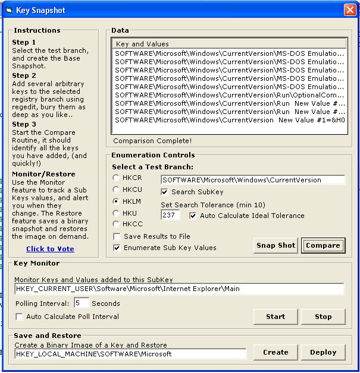



## Registry Enumeration Repair and Monitoring Tool

### Description

Re-written to include optional value enumeration. Added a registry monitoring routine, that could easily be expanded into a pre-commercial spyware monitoring application.

Auto calculates ideal polling intervals based on number of values being monitored.

Enumeration routine uses recursion with collections and arrays, and is very fast.

Comparison engine includes adjustable tolerances, and search window reacts dynamically based on new key/value frequency.

Added aglorithm that calculates ideal search tolerances based on difference size/array size. Can take a binary image of a registry branch and restore. Auto snapshot and user choice restore values during monitoring cycles.

A lot of good code here.. If people vote on this, maybe I'll add a routine that shows you how to snapshot and compare files on your hard drive too..

John
 
### More Info
 
array, UI markers

             |
---                |---
**Submitted On**   |2005-07-25 14:14:00
**By**             |[Steppenwolfe](https://github.com/Planet-Source-Code/PSCIndex/blob/master/ByAuthor/steppenwolfe.md)
**Level**          |Intermediate
**User Rating**    |5.0 (55 globes from 11 users)
**Compatibility**  |VB 6\.0
**Category**       |[Complete Applications](https://github.com/Planet-Source-Code/PSCIndex/blob/master/ByCategory/complete-applications__1-27.md)
**World**          |[Visual Basic](https://github.com/Planet-Source-Code/PSCIndex/blob/master/ByWorld/visual-basic.md)
**Archive File**   |[Registry\_E1917277252005\.zip](https://github.com/Planet-Source-Code/steppenwolfe-registry-enumeration-repair-and-monitoring-tool__1-61832/archive/master.zip)

